# 🎯 Diagrama de Casos de Uso - Sistema de Fidelización Chipa&Co

## 📋 RESUMEN

Este documento presenta el diagrama de casos de uso completo del sistema de fidelización, mostrando todas las interacciones entre actores (usuarios) y el sistema, organizadas por roles y funcionalidades.

---

## 🎭 ACTORES DEL SISTEMA

### Actores Principales
- **👤 Cliente**: Usuario final que compra productos y canjea premios
- **👨‍💼 Administrador**: Usuario con privilegios administrativos completos
- **🔐 Sistema de Autenticación**: Google OAuth y sistema interno de autenticación

### Actores Secundarios
- **📱 Sistema de Notificaciones**: Para alertas y confirmaciones
- **☁️ Servicios Externos**: Cloudinary, reCAPTCHA, APIs externas
- **⏰ Sistema de Cron**: Para tareas automáticas programadas

---

## 📊 DIAGRAMA DE CASOS DE USO COMPLETO

```mermaid
graph TB
    %% Actores
    Cliente[👤 Cliente]
    Admin[👨‍💼 Administrador]
    GoogleAuth[🔐 Google OAuth]
    Sistema[⚙️ Sistema]
    Cloudinary[☁️ Cloudinary]
    Cron[⏰ Cron Jobs]
    
    %% Casos de uso del Cliente
    subgraph "CASOS DE USO - CLIENTE"
        UC1[Registrarse]
        UC2[Iniciar Sesión]
        UC3[Login con Google]
        UC4[Completar Perfil]
        UC5[Ver Premios Disponibles]
        UC6[Canjear Premio]
        UC7[Ver Historial de Canjes]
        UC8[Ver Puntos Actuales]
        UC9[Ver Perfil]
        UC10[Editar Perfil]
        UC11[Cambiar Contraseña]
        UC12[Cerrar Sesión]
    end
    
    %% Casos de uso del Administrador
    subgraph "CASOS DE USO - ADMINISTRADOR"
        UC13[Dashboard Administrativo]
        UC14[Gestionar Productos]
        UC15[Crear Producto]
        UC16[Editar Producto]
        UC17[Activar/Desactivar Producto]
        UC18[Gestionar Premios]
        UC19[Crear Premio]
        UC20[Editar Premio]
        UC21[Activar/Desactivar Premio]
        UC22[Subir Imagen de Premio]
        UC23[Gestionar Usuarios]
        UC24[Ver Lista de Usuarios]
        UC25[Cambiar Rol de Usuario]
        UC26[Ver Historial de Usuario]
        UC27[Crear Orden]
        UC28[Buscar Usuario por DNI]
        UC29[Agregar Productos a Orden]
        UC30[Confirmar Orden]
        UC31[Validar Premios Canjeados]
        UC32[Aprobar Premio]
        UC33[Rechazar Premio]
        UC34[Gestionar Premios Vencidos]
        UC35[Ver Ranking de Usuarios]
        UC36[Configurar Sistema]
        UC37[Cambiar Puntos por Peso]
        UC38[Cambiar Límite de Puntos]
        UC39[Cambiar Contraseña Admin]
        UC40[Backup de Órdenes]
        UC41[Limpieza de Datos]
        UC42[Ver Estadísticas]
        UC43[Ver Reportes de Ventas]
        UC44[Ver Productos Más Vendidos]
        UC45[Ver Premios Más Canjeados]
    end
    
    %% Casos de uso del Sistema
    subgraph "CASOS DE USO - SISTEMA"
        UC46[Calcular Puntos Automáticamente]
        UC47[Actualizar Stock de Premios]
        UC48[Vencer Premios Automáticamente]
        UC49[Eliminar Premios Expirados]
        UC50[Generar Tokens JWT]
        UC51[Validar Tokens JWT]
        UC52[Rate Limiting]
        UC53[Logging de Seguridad]
        UC54[Backup Automático]
        UC55[Limpieza Automática]
        UC56[Enviar Notificaciones]
        UC57[Validar Formularios]
        UC58[Sanitizar Entradas]
        UC59[Encriptar Contraseñas]
        UC60[Verificar Permisos]
    end
    
    %% Relaciones Cliente
    Cliente --> UC1
    Cliente --> UC2
    Cliente --> UC3
    Cliente --> UC4
    Cliente --> UC5
    Cliente --> UC6
    Cliente --> UC7
    Cliente --> UC8
    Cliente --> UC9
    Cliente --> UC10
    Cliente --> UC11
    Cliente --> UC12
    
    %% Relaciones Administrador
    Admin --> UC13
    Admin --> UC14
    Admin --> UC15
    Admin --> UC16
    Admin --> UC17
    Admin --> UC18
    Admin --> UC19
    Admin --> UC20
    Admin --> UC21
    Admin --> UC22
    Admin --> UC23
    Admin --> UC24
    Admin --> UC25
    Admin --> UC26
    Admin --> UC27
    Admin --> UC28
    Admin --> UC29
    Admin --> UC30
    Admin --> UC31
    Admin --> UC32
    Admin --> UC33
    Admin --> UC34
    Admin --> UC35
    Admin --> UC36
    Admin --> UC37
    Admin --> UC38
    Admin --> UC39
    Admin --> UC40
    Admin --> UC41
    Admin --> UC42
    Admin --> UC43
    Admin --> UC44
    Admin --> UC45
    
    %% Relaciones Google OAuth
    GoogleAuth --> UC3
    GoogleAuth --> UC4
    
    %% Relaciones Cloudinary
    Cloudinary --> UC22
    
    %% Relaciones Cron
    Cron --> UC48
    Cron --> UC49
    Cron --> UC54
    Cron --> UC55
    
    %% Relaciones del Sistema
    Sistema --> UC46
    Sistema --> UC47
    Sistema --> UC48
    Sistema --> UC49
    Sistema --> UC50
    Sistema --> UC51
    Sistema --> UC52
    Sistema --> UC53
    Sistema --> UC54
    Sistema --> UC55
    Sistema --> UC56
    Sistema --> UC57
    Sistema --> UC58
    Sistema --> UC59
    Sistema --> UC60
    
    %% Dependencias entre casos de uso
    UC3 -.-> UC4
    UC6 -.-> UC31
    UC27 -.-> UC46
    UC30 -.-> UC46
    UC32 -.-> UC47
    UC33 -.-> UC47
    UC48 -.-> UC49
    UC2 -.-> UC50
    UC3 -.-> UC50
    UC1 -.-> UC59
    UC11 -.-> UC59
    UC39 -.-> UC59
```



---

## 🔄 FLUJOS PRINCIPALES DE CASOS DE USO

### 1. **FLUJO DE REGISTRO Y AUTENTICACIÓN**

#### 1.1 Registro Tradicional
```
Cliente → Registrarse → Validar Datos → Encriptar Contraseña → Crear Usuario → Login Automático
```

#### 1.2 Registro con Google
```
Cliente → Login con Google → Google OAuth → Completar Perfil → Crear Usuario → Acceso al Sistema
```

### 2. **FLUJO DE COMPRA Y ACUMULACIÓN DE PUNTOS**

```
Administrador → Buscar Usuario por DNI → Agregar Productos a Orden → 
Confirmar Orden → Calcular Puntos Automáticamente → Actualizar Puntos del Usuario
```

### 3. **FLUJO DE CANJE DE PREMIOS**

```
Cliente → Ver Premios Disponibles → Seleccionar Premio → Modal de Confirmación → 
Confirmar Canje → Validar Premios Canjeados → Administrador Aprobar/Rechazar → 
Actualizar Stock de Premios
```

### 4. **FLUJO DE VENCIMIENTO AUTOMÁTICO**

```
Sistema → Cron Jobs → Vencer Premios Automáticamente → Eliminar Premios Expirados → 
Limpieza Automática → Gestionar Premios Vencidos
```

---

## 📋 DESCRIPCIÓN DETALLADA DE CASOS DE USO

### **UC-001: Registrarse**
- **Actor**: Cliente
- **Descripción**: El cliente se registra en el sistema con email, contraseña, nombre y DNI
- **Precondiciones**: El cliente no debe estar registrado previamente
- **Flujo Principal**:
  1. Cliente accede al formulario de registro
  2. Completa email, contraseña, nombre y DNI
  3. Sistema valida datos
  4. Sistema encripta contraseña
  5. Sistema crea usuario
  6. Sistema genera token JWT
  7. Cliente es redirigido a su panel

### **UC-002: Iniciar Sesión**
- **Actor**: Cliente/Administrador
- **Descripción**: El usuario inicia sesión con email y contraseña
- **Precondiciones**: El usuario debe estar registrado
- **Flujo Principal**:
  1. Usuario ingresa email y contraseña
  2. Sistema valida credenciales
  3. Sistema genera token JWT
  4. Sistema redirige según rol (USER → /cliente, ADMIN → /admin)

### **UC-003: Login con Google**
- **Actor**: Cliente
- **Descripción**: El cliente inicia sesión usando Google OAuth
- **Precondiciones**: Conexión a internet y cuenta de Google
- **Flujo Principal**:
  1. Cliente hace clic en "Iniciar con Google"
  2. Redirige a Google OAuth
  3. Cliente autoriza aplicación
  4. Google retorna datos del usuario
  5. Sistema crea/actualiza usuario
  6. Si es nuevo usuario, redirige a completar perfil

### **UC-006: Canjear Premio**
- **Actor**: Cliente
- **Descripción**: El cliente canjea puntos por un premio
- **Precondiciones**: Cliente autenticado, puntos suficientes, premio disponible
- **Flujo Principal**:
  1. Cliente ve premios disponibles
  2. Selecciona un premio
  3. Sistema muestra modal de confirmación
  4. Cliente confirma canje
  5. Sistema valida puntos y stock
  6. Sistema crea RewardClaim con estado PENDING
  7. Sistema decrementa puntos del usuario
  8. Sistema establece fecha de vencimiento (24h)

### **UC-027: Crear Orden**
- **Actor**: Administrador
- **Descripción**: El administrador crea una nueva orden de compra
- **Precondiciones**: Administrador autenticado, productos disponibles
- **Flujo Principal**:
  1. Administrador busca usuario por DNI
  2. Sistema encuentra usuario
  3. Administrador agrega productos a la orden
  4. Sistema calcula total automáticamente
  5. Administrador confirma orden
  6. Sistema crea orden y items
  7. Sistema calcula puntos automáticamente
  8. Sistema actualiza puntos del usuario

### **UC-031: Validar Premios Canjeados**
- **Actor**: Administrador
- **Descripción**: El administrador valida premios canjeados por clientes
- **Precondiciones**: Administrador autenticado, premios pendientes
- **Flujo Principal**:
  1. Administrador ve lista de premios pendientes
  2. Revisa detalles del canje
  3. Decide aprobar o rechazar
  4. Sistema actualiza estado del premio
  5. Si rechaza, sistema devuelve puntos al usuario

### **UC-048: Vencer Premios Automáticamente**
- **Actor**: Sistema (Cron Jobs)
- **Descripción**: El sistema vence automáticamente premios que han expirado
- **Precondiciones**: Premios con estado PENDING y fecha de vencimiento pasada
- **Flujo Principal**:
  1. Cron job ejecuta verificación
  2. Sistema busca premios PENDING vencidos
  3. Sistema cambia estado a EXPIRED
  4. Sistema registra acción en logs

---

## 🔗 RELACIONES ENTRE CASOS DE USO

### **Inclusión (Include)**
- UC-001 incluye UC-059 (Encriptar Contraseñas)
- UC-002 incluye UC-050 (Generar Tokens JWT)
- UC-003 incluye UC-050 (Generar Tokens JWT)
- UC-006 incluye UC-047 (Actualizar Stock de Premios)
- UC-027 incluye UC-046 (Calcular Puntos Automáticamente)

### **Extensión (Extend)**
- UC-003 extiende UC-002 (Login con Google extiende Iniciar Sesión)
- UC-004 extiende UC-003 (Completar Perfil extiende Login con Google)

### **Generalización**
- UC-002 y UC-003 son generalizaciones de "Autenticación"
- UC-015, UC-016, UC-17 son generalizaciones de "Gestionar Productos"
- UC-019, UC-020, UC-021 son generalizaciones de "Gestionar Premios"

---

## 📊 MÉTRICAS DE USO

### Casos de Uso Más Críticos
1. **UC-002**: Iniciar Sesión (uso diario)
2. **UC-006**: Canjear Premio (funcionalidad principal)
3. **UC-027**: Crear Orden (operación de negocio)
4. **UC-031**: Validar Premios Canjeados (control de calidad)

### Casos de Uso de Seguridad
1. **UC-050**: Generar Tokens JWT
2. **UC-051**: Validar Tokens JWT
3. **UC-052**: Rate Limiting
4. **UC-053**: Logging de Seguridad

### Casos de Uso Automáticos
1. **UC-048**: Vencer Premios Automáticamente
2. **UC-049**: Eliminar Premios Expirados
3. **UC-054**: Backup Automático
4. **UC-055**: Limpieza Automática

---

## 🎯 PRIORIZACIÓN DE DESARROLLO

### **Fase 1 - Core (Crítico)**
- UC-001, UC-002, UC-003: Autenticación
- UC-006: Canje de Premios
- UC-027: Crear Orden
- UC-031: Validar Premios

### **Fase 2 - Gestión (Importante)**
- UC-014 a UC-021: Gestión de Productos y Premios
- UC-023 a UC-026: Gestión de Usuarios
- UC-035: Ranking de Usuarios

### **Fase 3 - Automatización (Deseable)**
- UC-048, UC-049: Vencimiento Automático
- UC-054, UC-055: Backup y Limpieza
- UC-052, UC-053: Seguridad Avanzada

---

**📅 Fecha de Creación**: $(date)  
**👨‍💻 Versión**: 1.0  
**📝 Estado**: Aprobado
