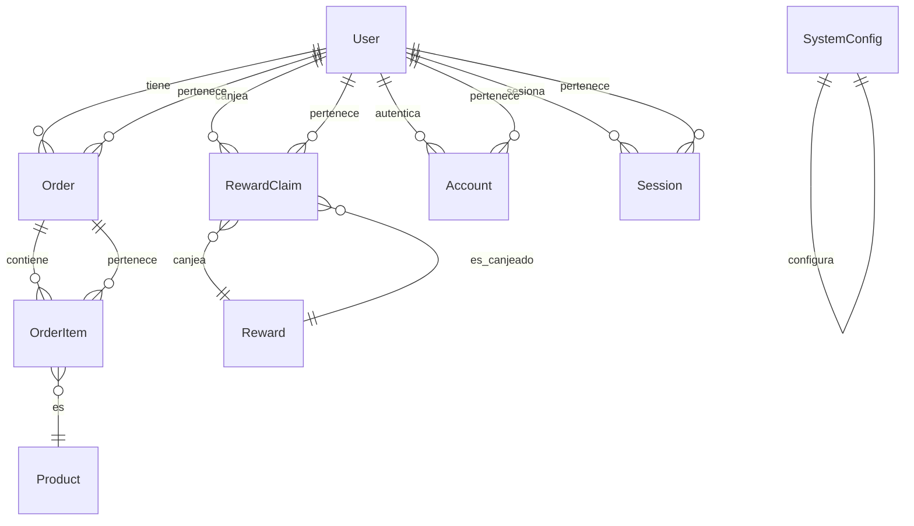

# 🗄️ Modelos de Datos y Diseño - Sistema de Fidelización Chipa&Co

## 📋 RESUMEN

Este documento presenta los modelos de datos, patrones de diseño, arquitectura y estructura completa del sistema de fidelización, incluyendo el esquema de base de datos, relaciones, índices, y patrones de diseño implementados.

---

## 🏗️ ARQUITECTURA DEL SISTEMA

### **Stack Tecnológico**
- **Frontend**: Next.js 14 (App Router) + React 19 + TypeScript
- **Backend**: Next.js API Routes + Node.js
- **Base de Datos**: PostgreSQL + Prisma ORM v6.12.0
- **Autenticación**: NextAuth.js + JWT + Google OAuth 2.0
- **Styling**: Tailwind CSS v4
- **Deployment**: Vercel
- **Servicios Externos**: Cloudinary, reCAPTCHA Enterprise

### **Patrón Arquitectónico**
- **Arquitectura**: Monolítica con separación de capas
- **Patrón**: MVC (Model-View-Controller)
- **API**: RESTful con Next.js API Routes
- **Estado**: React Context + Custom Hooks
- **Caché**: React Query + Context API

---

## 🗃️ MODELO DE DATOS COMPLETO

### **Esquema de Base de Datos (Prisma)**

```prisma
// ===========================================
// GENERADOR Y CONFIGURACIÓN
// ===========================================
generator client {
  provider = "prisma-client-js"
  output   = "../src/generated/prisma"
}

datasource db {
  provider = "postgresql"
  url      = env("DATABASE_URL")
}

// ===========================================
// ENUMS
// ===========================================
enum UserRole {
  USER
  ADMIN
}

// ===========================================
// MODELO PRINCIPAL: USUARIO
// ===========================================
model User {
  id           String        @id @default(uuid())
  name         String
  email        String        @unique
  dni          String?       @unique // Opcional para usuarios de Google
  createdAt    DateTime      @default(now())
  password     String?       // Opcional para usuarios de Google
  updatedAt    DateTime      @updatedAt
  puntos       Int           @default(0)
  puntosHistoricos Int       @default(0) // Puntos totales ganados históricamente
  role         UserRole      @default(USER)
  
  // Relaciones
  orders       Order[]
  rewardClaims RewardClaim[]
  accounts     Account[]
  sessions     Session[]
  
  // Campos para usuarios de Google
  image        String?       // Avatar de Google
  emailVerified DateTime?    // Verificación de email de Google
  isGoogleUser Boolean       @default(false) // Flag para identificar usuarios de Google
  needsProfileCompletion Boolean @default(false) // Flag para completar perfil
  
  // Índices
  @@index([email])
  @@index([dni])
  @@index([role])
  @@index([puntos])
  @@index([createdAt])
}

// ===========================================
// MODELO: PRODUCTO
// ===========================================
model Product {
  id          String      @id @default(uuid())
  name        String
  price       Float
  description String?
  isActive    Boolean     @default(true)
  createdAt   DateTime    @default(now())
  updatedAt   DateTime    @updatedAt
  
  // Relaciones
  orderItems  OrderItem[]
  
  // Índices
  @@index([isActive])
  @@index([name])
  @@index([price])
}

// ===========================================
// MODELO: CONFIGURACIÓN DEL SISTEMA
// ===========================================
model SystemConfig {
  id          String   @id @default(uuid())
  key         String   @unique
  value       String
  description String?
  createdAt   DateTime @default(now())
  updatedAt   DateTime @updatedAt
  
  // Índices
  @@index([key])
}

// ===========================================
// MODELO: ORDEN DE COMPRA
// ===========================================
model Order {
  id          String      @id @default(uuid())
  totalAmount Float
  totalPoints Int
  clientDni   String
  createdAt   DateTime    @default(now())
  
  // Relaciones
  items       OrderItem[]
  client      User        @relation(fields: [clientDni], references: [dni], onDelete: Cascade)
  
  // Índices
  @@index([clientDni])
  @@index([createdAt])
  @@index([totalAmount])
}

// ===========================================
// MODELO: ITEM DE ORDEN
// ===========================================
model OrderItem {
  id        String  @id @default(uuid())
  orderId   String
  productId String
  quantity  Int
  unitPrice Float
  total     Float
  
  // Relaciones
  order     Order   @relation(fields: [orderId], references: [id], onDelete: Cascade)
  product   Product @relation(fields: [productId], references: [id], onDelete: Cascade)
  
  // Índices
  @@index([orderId])
  @@index([productId])
}

// ===========================================
// MODELO: PREMIO
// ===========================================
model Reward {
  id          String        @id @default(uuid())
  name        String
  description String?
  pointsCost  Int
  isActive    Boolean       @default(true)
  imageUrl    String?
  stock       Int?
  createdAt   DateTime      @default(now())
  updatedAt   DateTime      @updatedAt
  
  // Relaciones
  claims      RewardClaim[]
  
  // Índices
  @@index([isActive])
  @@index([pointsCost])
  @@index([stock])
}

// ===========================================
// MODELO: CANJE DE PREMIO
// ===========================================
model RewardClaim {
  id          String   @id @default(uuid())
  rewardId    String
  userId      String
  pointsSpent Int
  status      String   @default("PENDING") // PENDING, APPROVED, REJECTED, EXPIRED
  expiresAt   DateTime
  createdAt   DateTime @default(now())
  updatedAt   DateTime @updatedAt
  
  // Relaciones
  reward      Reward   @relation(fields: [rewardId], references: [id])
  user        User     @relation(fields: [userId], references: [id])
  
  // Índices
  @@index([userId])
  @@index([rewardId])
  @@index([status])
  @@index([expiresAt])
  @@index([createdAt])
}

// ===========================================
// MODELOS DE NEXTAUTH.JS
// ===========================================
model Account {
  id                String  @id @default(cuid())
  userId            String
  type              String
  provider          String
  providerAccountId String
  refresh_token     String? @db.Text
  access_token      String? @db.Text
  expires_at        Int?
  token_type        String?
  scope             String?
  id_token          String? @db.Text
  session_state     String?

  user User @relation(fields: [userId], references: [id], onDelete: Cascade)

  @@unique([provider, providerAccountId])
  @@index([userId])
}

model Session {
  id           String   @id @default(cuid())
  sessionToken String   @unique
  userId       String
  expires      DateTime
  user         User     @relation(fields: [userId], references: [id], onDelete: Cascade)
  
  @@index([userId])
  @@index([expires])
}

model VerificationToken {
  identifier String
  token      String   @unique
  expires    DateTime

  @@unique([identifier, token])
}
```

---

## 🔗 RELACIONES ENTRE MODELOS

### **Diagrama de Relaciones**



### **Descripción de Relaciones**

#### **User (Usuario)**
- **1:N con Order**: Un usuario puede tener múltiples órdenes
- **1:N con RewardClaim**: Un usuario puede canjear múltiples premios
- **1:N con Account**: Un usuario puede tener múltiples cuentas (Google, etc.)
- **1:N con Session**: Un usuario puede tener múltiples sesiones

#### **Order (Orden)**
- **N:1 con User**: Una orden pertenece a un usuario
- **1:N con OrderItem**: Una orden contiene múltiples items

#### **OrderItem (Item de Orden)**
- **N:1 con Order**: Un item pertenece a una orden
- **N:1 con Product**: Un item referencia un producto

#### **Reward (Premio)**
- **1:N con RewardClaim**: Un premio puede ser canjeado múltiples veces

#### **RewardClaim (Canje de Premio)**
- **N:1 con User**: Un canje pertenece a un usuario
- **N:1 con Reward**: Un canje referencia un premio

---

## 📊 ÍNDICES Y OPTIMIZACIÓN

### **Índices Primarios**
```sql
-- Usuarios
CREATE INDEX idx_user_email ON "User"(email);
CREATE INDEX idx_user_dni ON "User"(dni);
CREATE INDEX idx_user_role ON "User"(role);
CREATE INDEX idx_user_puntos ON "User"(puntos);
CREATE INDEX idx_user_created_at ON "User"("createdAt");

-- Productos
CREATE INDEX idx_product_is_active ON "Product"("isActive");
CREATE INDEX idx_product_name ON "Product"(name);
CREATE INDEX idx_product_price ON "Product"(price);

-- Órdenes
CREATE INDEX idx_order_client_dni ON "Order"("clientDni");
CREATE INDEX idx_order_created_at ON "Order"("createdAt");
CREATE INDEX idx_order_total_amount ON "Order"("totalAmount");

-- Items de Orden
CREATE INDEX idx_order_item_order_id ON "OrderItem"("orderId");
CREATE INDEX idx_order_item_product_id ON "OrderItem"("productId");

-- Premios
CREATE INDEX idx_reward_is_active ON "Reward"("isActive");
CREATE INDEX idx_reward_points_cost ON "Reward"("pointsCost");
CREATE INDEX idx_reward_stock ON "Reward"(stock);

-- Canjes de Premio
CREATE INDEX idx_reward_claim_user_id ON "RewardClaim"("userId");
CREATE INDEX idx_reward_claim_reward_id ON "RewardClaim"("rewardId");
CREATE INDEX idx_reward_claim_status ON "RewardClaim"(status);
CREATE INDEX idx_reward_claim_expires_at ON "RewardClaim"("expiresAt");
CREATE INDEX idx_reward_claim_created_at ON "RewardClaim"("createdAt");

-- Sesiones
CREATE INDEX idx_session_user_id ON "Session"("userId");
CREATE INDEX idx_session_expires ON "Session"(expires);
```

### **Índices Compuestos**
```sql
-- Para búsquedas frecuentes
CREATE INDEX idx_user_role_puntos ON "User"(role, puntos);
CREATE INDEX idx_reward_active_cost ON "Reward"("isActive", "pointsCost");
CREATE INDEX idx_claim_user_status ON "RewardClaim"("userId", status);
CREATE INDEX idx_order_client_date ON "Order"("clientDni", "createdAt");
```

---

## 🎨 PATRONES DE DISEÑO IMPLEMENTADOS

### **1. Repository Pattern**
```typescript
// src/lib/repositories/UserRepository.ts
export class UserRepository {
  async findByEmail(email: string): Promise<User | null> {
    return await prisma.user.findUnique({ where: { email } });
  }
  
  async findByDni(dni: string): Promise<User | null> {
    return await prisma.user.findUnique({ where: { dni } });
  }
  
  async updatePoints(userId: string, points: number): Promise<User> {
    return await prisma.user.update({
      where: { id: userId },
      data: { puntos: { increment: points } }
    });
  }
}
```

### **2. Service Layer Pattern**
```typescript
// src/lib/services/OrderService.ts
export class OrderService {
  constructor(private userRepo: UserRepository) {}
  
  async createOrder(orderData: CreateOrderData): Promise<Order> {
    return await prisma.$transaction(async (tx) => {
      // Crear orden
      const order = await tx.order.create({ data: orderData });
      
      // Actualizar puntos del usuario
      await this.userRepo.updatePoints(orderData.clientId, orderData.totalPoints);
      
      return order;
    });
  }
}
```

### **3. Factory Pattern**
```typescript
// src/lib/factories/TokenFactory.ts
export class TokenFactory {
  static createJWT(payload: JWTPayload): string {
    return jwt.sign(payload, process.env.JWT_SECRET!, {
      expiresIn: '7d',
      issuer: 'app-fidelizacion-auth',
      audience: 'app-fidelizacion'
    });
  }
  
  static createRefreshToken(payload: JWTPayload): string {
    return jwt.sign(payload, process.env.REFRESH_SECRET!, {
      expiresIn: '30d'
    });
  }
}
```

### **4. Observer Pattern**
```typescript
// src/lib/observers/RewardExpirationObserver.ts
export class RewardExpirationObserver {
  private observers: RewardExpirationListener[] = [];
  
  subscribe(listener: RewardExpirationListener): void {
    this.observers.push(listener);
  }
  
  notifyExpired(rewardClaim: RewardClaim): void {
    this.observers.forEach(observer => observer.onRewardExpired(rewardClaim));
  }
}
```

### **5. Strategy Pattern**
```typescript
// src/lib/strategies/PointsCalculationStrategy.ts
export interface PointsCalculationStrategy {
  calculate(amount: number): number;
}

export class StandardPointsStrategy implements PointsCalculationStrategy {
  constructor(private pointsPerPeso: number) {}
  
  calculate(amount: number): number {
    return Math.floor(amount * this.pointsPerPeso);
  }
}

export class BonusPointsStrategy implements PointsCalculationStrategy {
  constructor(private basePoints: number, private bonusMultiplier: number) {}
  
  calculate(amount: number): number {
    return Math.floor(amount * this.basePoints * this.bonusMultiplier);
  }
}
```

### **6. Decorator Pattern**
```typescript
// src/lib/decorators/WithLogging.ts
export function WithLogging(target: any, propertyName: string, descriptor: PropertyDescriptor) {
  const method = descriptor.value;
  
  descriptor.value = async function (...args: any[]) {
    console.log(`Calling ${propertyName} with args:`, args);
    const result = await method.apply(this, args);
    console.log(`${propertyName} returned:`, result);
    return result;
  };
}
```

---

## 🔧 ARQUITECTURA DE COMPONENTES

### **Estructura de Directorios**
```
src/
├── app/                    # Next.js App Router
│   ├── api/               # API Routes
│   │   ├── admin/         # Endpoints administrativos
│   │   ├── auth/          # Autenticación
│   │   ├── cron/          # Cron jobs
│   │   └── user/          # Endpoints de usuario
│   ├── admin/             # Páginas administrativas
│   ├── cliente/           # Páginas de cliente
│   └── auth-callback/     # Callback de OAuth
├── components/            # Componentes React
│   ├── ui/               # Componentes de UI base
│   ├── icons/            # Iconos personalizados
│   └── [feature]/        # Componentes específicos
├── lib/                  # Lógica de negocio
│   ├── auth/             # Autenticación
│   ├── hooks/            # Custom hooks
│   ├── services/         # Servicios de negocio
│   ├── repositories/     # Repositorios de datos
│   ├── strategies/       # Patrones Strategy
│   └── utils/            # Utilidades
├── contexts/             # React Contexts
└── generated/            # Código generado (Prisma)
```

### **Patrón de Hooks Personalizados**
```typescript
// src/lib/hooks/useAuth.ts
export function useAuth() {
  const [user, setUser] = useState<User | null>(null);
  const [loading, setLoading] = useState(true);
  
  const checkAuth = useCallback(async () => {
    try {
      const response = await fetch('/api/auth/me');
      const data = await response.json();
      setUser(data.user);
    } catch (error) {
      setUser(null);
    } finally {
      setLoading(false);
    }
  }, []);
  
  return { user, loading, checkAuth };
}

// src/lib/hooks/useCachedRewards.ts
export function useCachedRewards() {
  const [rewards, setRewards] = useState<Reward[]>([]);
  const [loading, setLoading] = useState(true);
  
  const fetchRewards = useCallback(async () => {
    setLoading(true);
    try {
      const response = await fetch('/api/rewards');
      const data = await response.json();
      setRewards(data.rewards);
    } finally {
      setLoading(false);
    }
  }, []);
  
  return { rewards, loading, refetch: fetchRewards };
}
```

---

## 🔐 PATRONES DE SEGURIDAD

### **1. Middleware de Autenticación**
```typescript
// src/middleware.ts
export async function middleware(request: NextRequest) {
  const token = request.cookies.get('auth-token')?.value;
  
  if (!token) {
    return NextResponse.redirect(new URL('/login', request.url));
  }
  
  try {
    const payload = await verifyToken(token);
    request.headers.set('user-id', payload.userId);
    request.headers.set('user-role', payload.role);
  } catch (error) {
    return NextResponse.redirect(new URL('/login', request.url));
  }
}
```

### **2. Rate Limiting**
```typescript
// src/lib/rateLimit.ts
export class RateLimiter {
  private attempts: Map<string, number[]> = new Map();
  
  isAllowed(identifier: string, maxAttempts: number, windowMs: number): boolean {
    const now = Date.now();
    const attempts = this.attempts.get(identifier) || [];
    
    // Limpiar intentos antiguos
    const validAttempts = attempts.filter(time => now - time < windowMs);
    
    if (validAttempts.length >= maxAttempts) {
      return false;
    }
    
    validAttempts.push(now);
    this.attempts.set(identifier, validAttempts);
    return true;
  }
}
```

### **3. Validación de Entrada**
```typescript
// src/lib/validations.ts
export class InputValidator {
  static validateEmail(email: string): boolean {
    const emailRegex = /^[^\s@]+@[^\s@]+\.[^\s@]+$/;
    return emailRegex.test(email);
  }
  
  static validateDNI(dni: string): boolean {
    const dniRegex = /^\d{7,8}$/;
    return dniRegex.test(dni);
  }
  
  static sanitizeInput(input: string): string {
    return input.trim().replace(/[<>]/g, '');
  }
}
```

---

## 📈 PATRONES DE RENDIMIENTO

### **1. Caché de Datos**
```typescript
// src/lib/cache/DataCache.ts
export class DataCache {
  private cache: Map<string, { data: any; expires: number }> = new Map();
  
  set(key: string, data: any, ttl: number = 300000): void {
    this.cache.set(key, {
      data,
      expires: Date.now() + ttl
    });
  }
  
  get(key: string): any | null {
    const item = this.cache.get(key);
    if (!item || Date.now() > item.expires) {
      this.cache.delete(key);
      return null;
    }
    return item.data;
  }
}
```

### **2. Lazy Loading**
```typescript
// src/components/LazyComponent.tsx
import { lazy, Suspense } from 'react';

const LazyAdminPanel = lazy(() => import('./AdminPanel'));

export function LazyAdminPanelWrapper() {
  return (
    <Suspense fallback={<div>Cargando...</div>}>
      <LazyAdminPanel />
    </Suspense>
  );
}
```

### **3. Optimización de Consultas**
```typescript
// src/lib/optimizations/QueryOptimizer.ts
export class QueryOptimizer {
  static async getUsersWithStats(): Promise<UserWithStats[]> {
    return await prisma.user.findMany({
      select: {
        id: true,
        name: true,
        email: true,
        puntos: true,
        puntosHistoricos: true,
        _count: {
          select: {
            orders: true,
            rewardClaims: true
          }
        }
      },
      orderBy: { puntosHistoricos: 'desc' }
    });
  }
}
```

---

## 🔄 PATRONES DE TRANSACCIONES

### **Transacciones de Base de Datos**
```typescript
// src/lib/transactions/OrderTransaction.ts
export class OrderTransaction {
  static async createOrderWithPoints(orderData: CreateOrderData): Promise<Order> {
    return await prisma.$transaction(async (tx) => {
      // 1. Crear orden
      const order = await tx.order.create({
        data: {
          totalAmount: orderData.totalAmount,
          totalPoints: orderData.totalPoints,
          clientDni: orderData.clientDni,
          items: {
            create: orderData.items.map(item => ({
              productId: item.productId,
              quantity: item.quantity,
              unitPrice: item.unitPrice,
              total: item.total
            }))
          }
        }
      });
      
      // 2. Actualizar puntos del usuario
      await tx.user.update({
        where: { dni: orderData.clientDni },
        data: {
          puntos: { increment: orderData.totalPoints },
          puntosHistoricos: { increment: orderData.totalPoints }
        }
      });
      
      return order;
    });
  }
}
```

---

## 📊 MÉTRICAS Y MONITOREO

### **Patrón de Logging**
```typescript
// src/lib/logging/SecurityLogger.ts
export class SecurityLogger {
  static logLoginAttempt(email: string, success: boolean, ip: string): void {
    console.log(JSON.stringify({
      timestamp: new Date().toISOString(),
      event: 'login_attempt',
      email,
      success,
      ip,
      userAgent: '...'
    }));
  }
  
  static logAdminAction(adminId: string, action: string, details: any): void {
    console.log(JSON.stringify({
      timestamp: new Date().toISOString(),
      event: 'admin_action',
      adminId,
      action,
      details
    }));
  }
}
```

---

## 🎯 MEJORES PRÁCTICAS IMPLEMENTADAS

### **1. Separación de Responsabilidades**
- **Controllers**: Manejan requests HTTP
- **Services**: Lógica de negocio
- **Repositories**: Acceso a datos
- **Models**: Estructura de datos

### **2. Manejo de Errores**
```typescript
// src/lib/errors/AppError.ts
export class AppError extends Error {
  constructor(
    public message: string,
    public statusCode: number = 500,
    public isOperational: boolean = true
  ) {
    super(message);
    Error.captureStackTrace(this, this.constructor);
  }
}
```

### **3. Validación de Tipos**
```typescript
// src/lib/types/OrderTypes.ts
export interface CreateOrderRequest {
  clientDni: string;
  items: Array<{
    productId: string;
    quantity: number;
  }>;
}

export interface OrderResponse {
  id: string;
  totalAmount: number;
  totalPoints: number;
  createdAt: Date;
  items: OrderItemResponse[];
}
```

### **4. Configuración Centralizada**
```typescript
// src/lib/config/AppConfig.ts
export const APP_CONFIG = {
  DATABASE: {
    URL: process.env.DATABASE_URL!,
    MAX_CONNECTIONS: 10
  },
  AUTH: {
    JWT_SECRET: process.env.JWT_SECRET!,
    JWT_EXPIRES_IN: '7d',
    REFRESH_EXPIRES_IN: '30d'
  },
  SECURITY: {
    RATE_LIMIT: {
      LOGIN: { max: 5, window: 15 * 60 * 1000 },
      REGISTER: { max: 3, window: 60 * 60 * 1000 }
    }
  }
} as const;
```

---

## 📋 RESUMEN DE PATRONES IMPLEMENTADOS

### **Patrones Creacionales**
- ✅ **Factory Pattern**: Para creación de tokens JWT
- ✅ **Builder Pattern**: Para construcción de consultas complejas
- ✅ **Singleton Pattern**: Para configuración global

### **Patrones Estructurales**
- ✅ **Adapter Pattern**: Para integración con servicios externos
- ✅ **Decorator Pattern**: Para logging y validación
- ✅ **Facade Pattern**: Para simplificar APIs complejas

### **Patrones Comportamentales**
- ✅ **Observer Pattern**: Para notificaciones de eventos
- ✅ **Strategy Pattern**: Para cálculo de puntos
- ✅ **Command Pattern**: Para operaciones administrativas
- ✅ **State Pattern**: Para estados de premios

### **Patrones Arquitectónicos**
- ✅ **Repository Pattern**: Para acceso a datos
- ✅ **Service Layer Pattern**: Para lógica de negocio
- ✅ **MVC Pattern**: Para separación de responsabilidades
- ✅ **Dependency Injection**: Para inyección de dependencias

---

**📅 Fecha de Creación**: $(date)  
**👨‍💻 Versión**: 1.0  
**📝 Estado**: Aprobado
